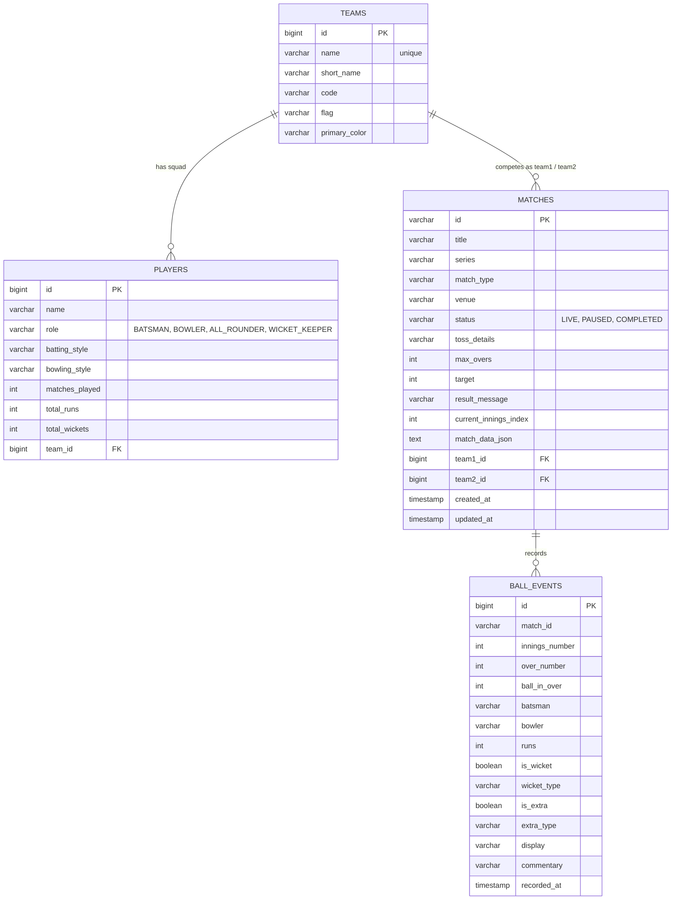

# Real-Time Cricket Score Management System

A scalable, real-time cricket scoring platform built with **Spring Boot 3**, providing persistent database storage, interactive REST APIs, live match simulation, Server-Sent Events (SSE) streaming, team and player roster maintenance, and a responsive web dashboard.

---

## Table of Contents

- [Overview](#overview)
- [Requirements Checklist & Verification](#requirements-checklist--verification)
- [System Architecture](#system-architecture)
- [Database Details & Persistent Storage](#database-details--persistent-storage)
- [REST API Documentation & Testing](#rest-api-documentation--testing)
  - [Interactive Swagger UI](#interactive-swagger-ui)
  - [Postman Collection](#postman-collection)
  - [cURL Command Examples](#curl-command-examples)
- [Key Features & Operations](#key-features--operations)
- [Project Structure](#project-structure)
- [Installation and Setup](#installation-and-setup)
- [Demonstration Walkthrough (Sample Ongoing Matches)](#demonstration-walkthrough-sample-ongoing-matches)

---

## Overview

The **Cricket Score Management System** simulates a live cricket scoring platform that manages concurrent cricket fixtures, dynamic run rates, target chase equations, live player statistics (batting and bowling), editorial commentary, automated live match simulations, and persistent database storage across server restarts.

---

## Requirements Checklist & Verification

| Requirement | Status | Implementation Details |
| :--- | :---: | :--- |
| **Spring Boot Core** | ✅ Complete | Built on Spring Boot 3.3.4, Java 17/25, Tomcat 10.1 embedded on port 8085. |
| **Create & Manage Matches** | ✅ Complete | REST endpoints `POST /api/matches`, `DELETE /api/matches/{id}`, `PUT /api/matches/{id}/status`, plus UI creation modal. |
| **Maintain Teams & Players** | ✅ Complete | JPA entities `TeamEntity`, `PlayerEntity`, repositories, REST endpoints `GET/POST /api/teams`, `GET/POST /api/players`, and dedicated "Teams & Players" UI tab. |
| **Record Runs, Wickets, Overs, Events** | ✅ Complete | `POST /api/matches/{id}/score-update` records dots, runs (1-6), wickets (bowled, caught, lbw, run-out), extras (wides, no-balls, byes, leg-byes), and persists each `BallEventEntity` to the database. |
| **Match & Score Management** | ✅ Complete | Match status transitions (LIVE, PAUSED, COMPLETED), strike rotations, over completions, bowler rotations, chase completion rules. |
| **Responsive Live Dashboard** | ✅ Complete | Semantic HTML5 & CSS3 with SSE streaming (`/api/matches/{id}/stream`) and fallback polling. |
| **Current Batting & Bowling Stats** | ✅ Complete | Live striker/non-striker indicators, balls faced, boundary counts, strike rates, current bowler overs, maidens, wickets, runs conceded, and economy. |
| **Match Summaries & Information** | ✅ Complete | Dedicated summary endpoint (`GET /api/matches/{id}/summary`) with Player of the Match, top run-scorer, best bowler, and match highlights. |
| **Database Connectivity for Persistent Storage** | ✅ Complete | Spring Data JPA + H2 persistent file-based database (`./data/cricketdb`) with H2 Web Console (`/h2-console`). |
| **Test REST APIs** | ✅ Complete | 13 automated MockMvc integration tests (`mvn test`), interactive Swagger UI (`/swagger-ui/index.html`), and ready-to-import Postman Collection (`Cricket_Score_Management_API.postman_collection.json`). |
| **Sample Ongoing Matches Demonstration** | ✅ Complete | Pre-seeded and custom ongoing fixtures (India vs Australia decider, England vs Pakistan clash, CSK vs MI IPL thriller, and custom created matches). |

---

## Database Details & Persistent Storage

The application uses **Spring Data JPA** with an **H2 file-backed relational database**. All teams, players, matches, innings snapshots, and individual ball deliveries are stored persistently in `./data/cricketdb.mv.db`.

### Database Connection Parameters

- **Database Type**: H2 Relational Database (File Persistence Mode)
- **JDBC URL**: `jdbc:h2:file:./data/cricketdb;DB_CLOSE_DELAY=-1;AUTO_SERVER=TRUE`
- **Driver Class**: `org.h2.Driver`
- **Username**: `sa`
- **Password**: `password`
- **H2 Web Console URL**: `http://localhost:8085/h2-console`

### Database Schema & Tables



---

## REST API Documentation & Testing

### Interactive Swagger UI
The application integrates **SpringDoc OpenAPI 3**. Navigate in your browser to:
```
http://localhost:8085/swagger-ui/index.html
```
From Swagger UI, you can inspect schemas, execute live API calls, and capture screenshots for documentation.

### Postman Collection
A pre-built Postman collection is included in the project root:
- **File**: `Cricket_Score_Management_API.postman_collection.json`
- **Base URL variable**: `http://localhost:8085`
- Contains ready-to-execute requests for Matches, Ball Scoring, Live Simulation, Teams, and Players.

### Key REST Endpoints

| Category | Method | Endpoint | Description |
| :--- | :--- | :--- | :--- |
| **Matches** | `GET` | `/api/matches` | Retrieve all matches |
| | `GET` | `/api/matches/{id}` | Retrieve match details, active players, and scorecards |
| | `POST` | `/api/matches` | Create a new match and persist to DB |
| | `DELETE`| `/api/matches/{id}` | Delete a match and associated ball history |
| | `PUT` | `/api/matches/{id}/status?status=...`| Update match status (LIVE, PAUSED, COMPLETED) |
| | `POST` | `/api/matches/{id}/reset` | Reset match state to initial scenario |
| | `GET` | `/api/matches/{id}/summary` | Retrieve post-match summary & awards |
| **Scoring** | `POST` | `/api/matches/{id}/score-update` | Manually record runs, wickets, extras, commentary |
| | `POST` | `/api/matches/{id}/simulate-ball`| Probabilistically simulate next ball |
| | `POST` | `/api/matches/{id}/auto-simulation`| Toggle background live delivery simulation |
| | `GET` | `/api/matches/{id}/stream` | SSE stream for zero-latency live score push |
| **Teams** | `GET` | `/api/teams` | Get all teams and squads |
| | `GET` | `/api/teams/{id}` | Get team details by ID |
| | `POST` | `/api/teams` | Register a new team in database |
| **Players** | `GET` | `/api/players` | Get all players across all teams |
| | `POST` | `/api/players` | Add a player to a team squad |

---

## Installation and Setup

### 1. Build the Project
```bash
mvn clean package
```
All 13 integration tests will run and pass, generating `target/cricket-score-management-1.0.0.jar`.

### 2. Run the Application
```bash
java -jar target/cricket-score-management-1.0.0.jar
```

### 3. Access Web Services
- **Web Dashboard**: `http://localhost:8085`
- **Swagger OpenAPI Docs**: `http://localhost:8085/swagger-ui/index.html`
- **H2 Database Web Console**: `http://localhost:8085/h2-console`
  *(JDBC URL: `jdbc:h2:file:./data/cricketdb`, User: `sa`, Password: `password`)*

---

## Demonstration Walkthrough (Sample Ongoing Matches)

1. **India vs Australia (3rd T20I Decider)**:
   - India chasing 189 at Wankhede Stadium.
   - Click **⚡ Step Ball** or **▶ Start Live Sim** to watch the chase unfold in real time.
2. **England vs Pakistan (T20 Super Clash)**:
   - England chasing 166 at Melbourne Cricket Ground.
3. **Chennai Super Kings vs Mumbai Indians (IPL Clash)**:
   - CSK batting first at Chepauk Stadium.
4. **Custom Match Creation**:
   - Click **➕ Create Match** on the dashboard, input teams (e.g. South Africa vs New Zealand), venue, and overs.
   - The match will be saved to the H2 database and appear immediately in the top navigation bar.
5. **Teams & Squads Inspection**:
   - Click the **👥 Teams & Players** tab to inspect full squads, player roles, and add new players/teams directly into persistent database storage.
